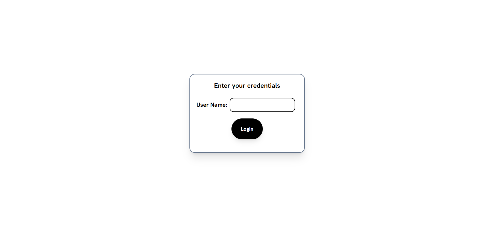
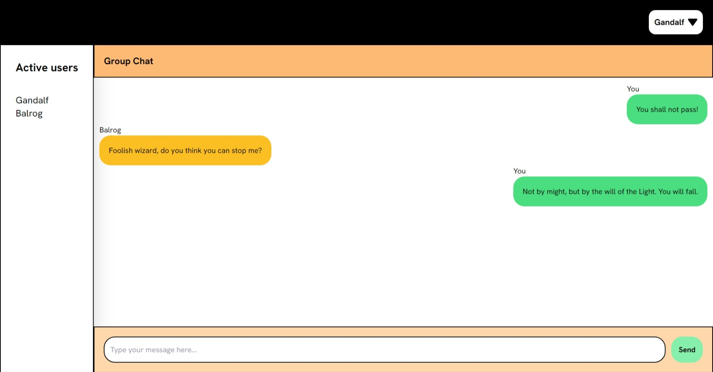
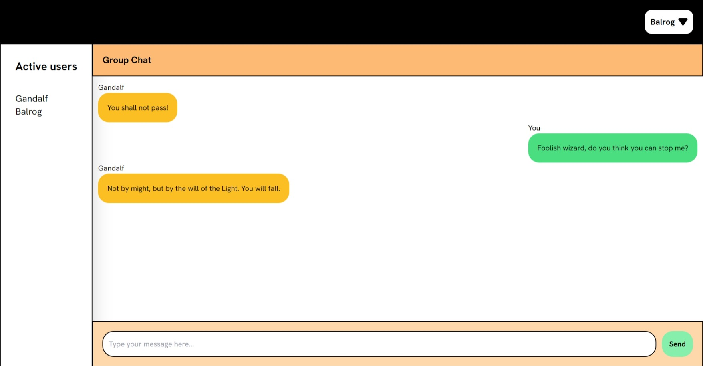

# About the project
This is a chatapp that enables realtime communiccation.

## Technologies used

- SocketIO
- ReactJS
- Tailwind CSS
- NodeJS
- ExpressJS

## Live demo

[Live demo link](https://realtime-chatapp-frontend.netlify.app/)

## Link to backend code

[Backend code](https://github.com/Pradikshan/chatapp-backend)

## Screenshots of the project

### Login Page

### Chat Page

